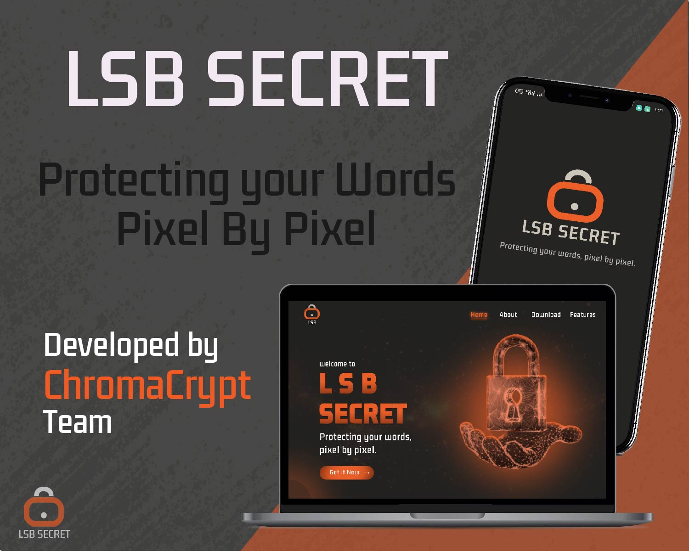
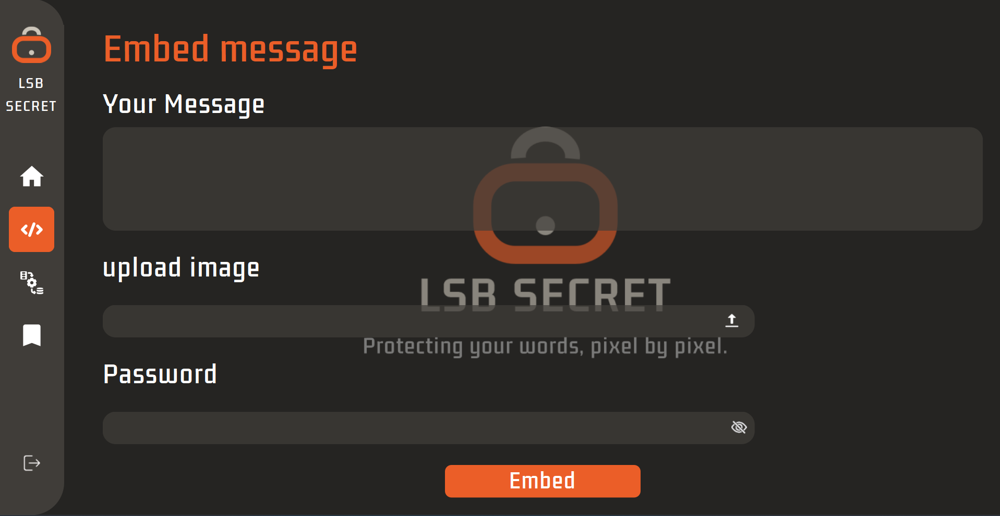
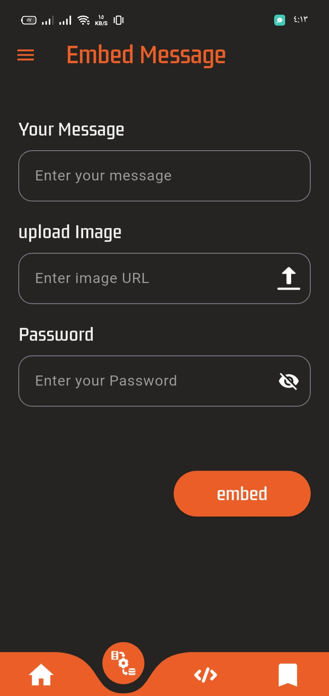
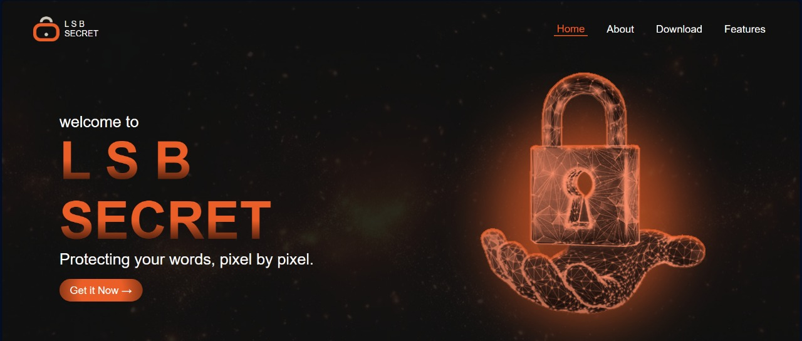

# 🔐 LSB_Secret

Welcome to **LSB_Secret** — a powerful, secure steganography application that lets you embed secret messages inside images using the Least Significant Bit (LSB) technique. Designed for both **Desktop** and **Mobile**, and supported by a dedicated **Website**, our solution ensures message protection, pixel by pixel.

---

## 📱 Platforms

- **🖥️ Desktop Application** (.exe installer)
- **📱 Android Mobile Application** (APK)
- **🌐 Website**: Learn more, see features, and download apps

---

## 🔍 What is LSB_Secret?

LSB_Secret is a steganography tool that allows users to hide confidential text messages inside images securely. It leverages:

-  Compression (to reduce size)
-  AES Encryption (for strong security)
-  LSB Steganography (to hide message in image)
-  History tracking of all embedded messages

---

## 🧠 How it Works

1. **User Registration/Login**
2. **Embed Message**:
   - Upload image (PNG, JPG, JPEG, BMP)
   - Enter a message and a password
   - The app compresses + encrypts + embeds the message
3. **Extract Message**:
   - Upload stego image
   - Enter password
   - The app decrypts and decompresses to reveal message

---

## 🖥️ Desktop Application

###  Features

- GUI built with **PyQt6**
- Local image support
- Secure encryption and compression
- Integrated Flask backend server
- Logs user actions
- Built-in message history viewer
- Installer includes all dependencies

  📥 [Download EXE](https://github.com/Yasser0Hamoda/LSB_Secret/releases/download/V1.0.0/LSB_Secret_Installer.exe)

---

## 📱 Android App

> APK available via website

- Lightweight
- Clean and user-friendly UI
- Works completely offline
- Compatible with Android 8+

📥 [Download APK](https://github.com/Yasser0Hamoda/LSB_Secret/releases/download/V1.0.0/LSB.Secret.apk)

---

## 🌐 Website

The official website provides:

- Info about the project
- Desktop and mobile downloads
- Visual guides and screenshots
- Contact & feedback

🔗 [Visit Website](https://lsb-secret.vercel.app/)

---

### 🛠 Installation

**Desktop**
1. Download the latest version of `LSB_Secret_Setup.exe` From The [Releases](https://github.com/Yasser0Hamoda/LSB_Secret/releases) tab.
2. Run the installer:
   - Installs all dependencies
   - Adds shortcut to Desktop / Start Menu
3. Launch the application from shortcut
4. Enjoy!

**Mobile**
1.Download The APK File from The [Releases](https://github.com/Yasser0Hamoda/LSB_Secret/releases) tab.
2.Setup The Application
3.And Also Enjoy😁 !

---

## 🧪 Technologies Used

- **PyQt6** For Desktop.
- **Flutter** For Moblie Application.
- **Python Flask** For Backend.
- **HTML, CSS, JS** For Website.

---

## 📄 License

- This project is licensed under the MIT License - see the LICENSE file for details.

---

🙋‍♂️ Authors

-  **Mahmoud Nader** — Software Engineer
-  **Yasser Hamoda** — Penetration Tester & Backend Developer   
-  **Menna Wageh** — Frontend Developer & UI/UX Designer
-  **Malak Alaa** — Penetration Tester & UI  
-  **Mohamed Ahmed** — Flutter Developer & Frontend Developer  

---

### 🎉 Thank you for using LSB_Secret!
> **📬 For feedback or contributions, feel free to open issues or pull requests.**
